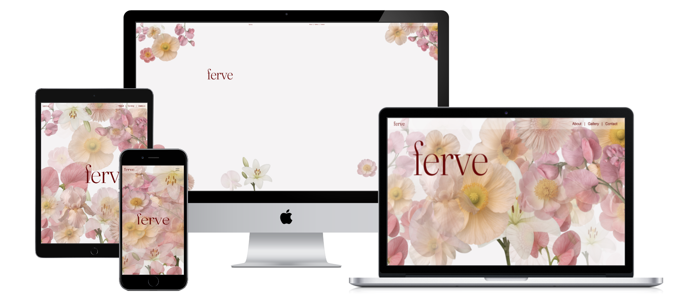
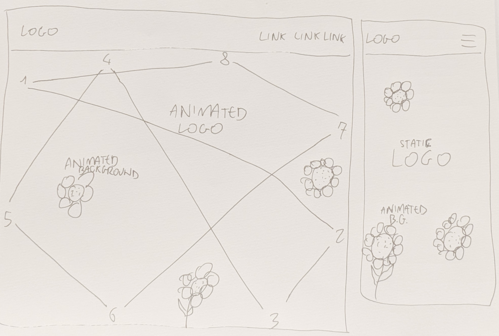
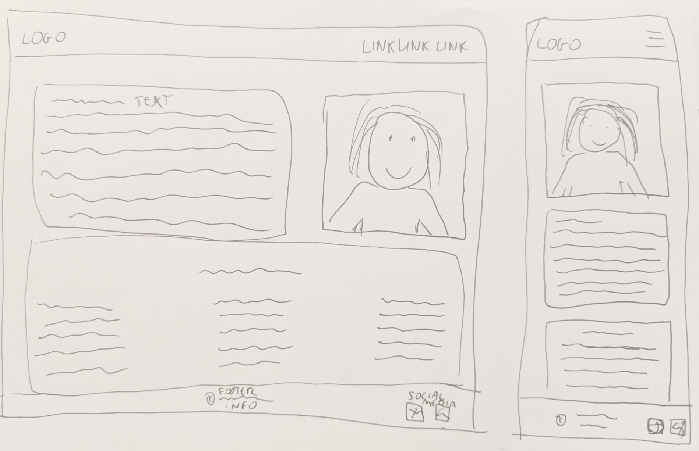
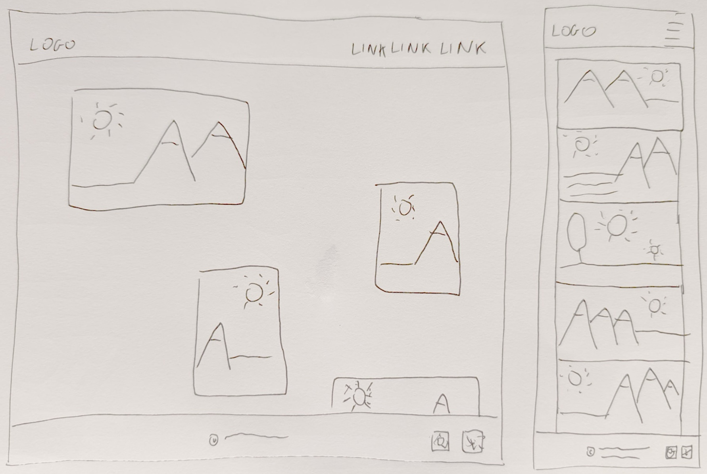
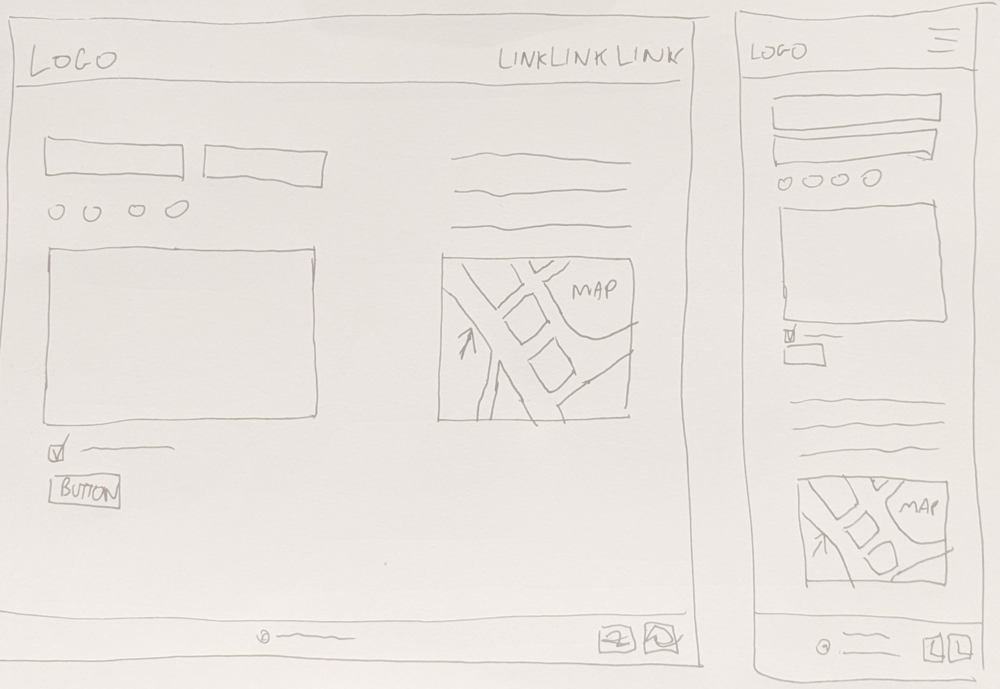
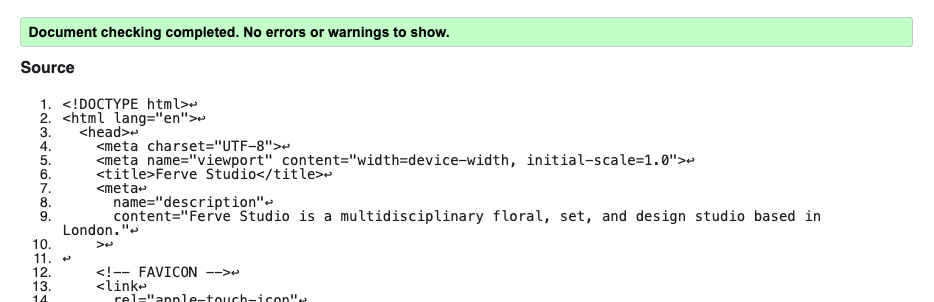
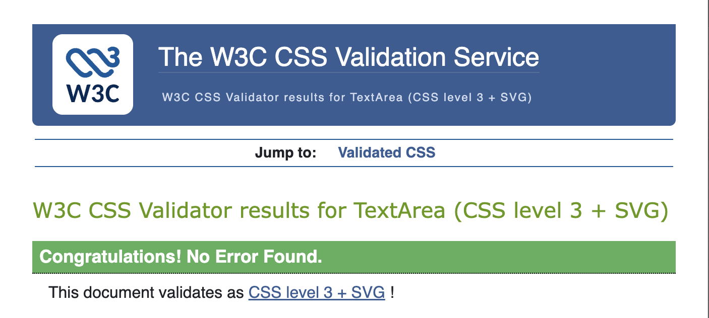
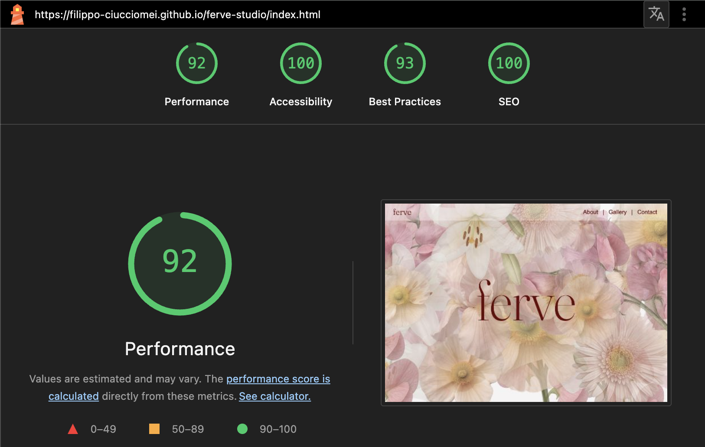

# 🌸 Ferve Studio Website

## Deployed website: 
https://filippo-ciucciomei.github.io/ferve-studio/

A modern and responsive website created for **Ferve Studio**, a florestry and set-design studio based in Hackney, East London (UK).  
The site acts as a **digital window display**, showcasing the studio’s aesthetic, services, and creative identity.  
Since every project is made-to-order and custom to each client, the website focuses on visual presentation rather than selling predefined items. Users can explore the studio's work and reach out through the built-in contact form.

---

## Overview

Ferve Studio specialises in **ad hoc set design, installations, and creative florestry work**.  
The website communicates:

- The services Ferve Studio offers
- The brand’s visual and creative identity
- How clients can get in touch for bespoke projects

The design is creatively arranged, reflecting the identity and values of the studio.

---

## Features

- Fully responsive layout using **Bootstrap 5**
- Hand-crafted **CSS animations**
- Clean navigation and intuitive structure
- Contact form for client inquiries
- Branding supported by Google Fonts and FontAwesome icons
- Mobile-first layout and smooth user experience

---

## Wireframes

# Index 

For the **landing** page I have created an **animation** made with flowers dissolving in a loop at different randomised time. On top of the animated flowers, the company logo is bouncing around the screen from side to side. 
On **mobile**, where the available space to bounce the logo is reduced, I have opted for a static logo.
I will upgrade this animation later-on using JS. 

# About 

In the **about** page I have combined some text and images. To create a clean and responsive layout, I have used Bootstrap row/column system, and I have used some not-displayed elements, that kept their position in the flow. 

# Gallery 

In the **gallery** page, for laptop or bigger screens, I have opted for a dynamic order of the images, to reflext the brand "out of ordinary" approach to design. I have placed the images inside BS columns that change size according to the screen size. As the screen reduces its size, the flow of images becomes less complex, till the mobile size, where the images are all one after the other, with no spaces between them. 

When overing an image you can see the image caption, and when clicking them, it will open a crousel into a large sized modal. 

The carousel will be improved later on with JS, to make sure that each image will point to the same image to start the carousel. 

# Contact 

In the **contact** page the visitor can submit a contact form with basic info, such as their details, and the type of enquiry. All fields, including the T&C agreement, must be completed to be able to submit the form. 

Below the form (or next to it on mobile size) there is a Google Maps iframe. 

There are two modals in this page, one to read the T&C, and one that confirms the message being sent correctly. 

---

## Tech Stack

- **HTML5**
- **CSS3**
- **Bootstrap 5**
- **Google Fonts**
- **FontAwesome**
- **ChatGPT**

---

## Special Highlights

- Custom **pure CSS animations** developed to enhance the brand's visual identity.
- Clean and modular code architecture designed for easy future improvements
- Animation systems are ready for potential upgrades using JavaScript for smoother, more dynamic effects
- Use of Modals for a better UX

---

## Project Structure

<pre> 
ferve-studio/
├── index.html
├── about.html
├── gallery/
│     ├── gallery-weddings.html
│     ├── gallery-events.html
│     └── gallery-editorials.html
├── contact.html
│
├── assets/
│     ├── css/
│     ├── images/
│     ├─background01.png
│     ├─about-portrait.webp
│     ├─wedding01.jpg
│     ├─editorial01.jpg
│     └─events01.jpg
│
├── readme-files/
│     ├── wire-index.jpg
│     ├── wire-about.jpg
│     ├── wire-gallery.jpg
│     ├── wire-contact.jpg
│     ├── css-validated.png
│     ├── html-validated.png
│     ├── lighthouse.png
│     └── all-devices-mockaup.png
│
 </pre>

---

## Installation & Usage

1. Clone or download this repository
2. Open **index.html** in your preferred browser
3. No setup required — all external resources (Bootstrap, Google Fonts, FontAwesome) load through CDN links

---

## Testing

- All internal navigation links work correctly across all screen sizes and devices
- Quote form prevents submission if required fields are left empty (native HTML5 validation)
- Responsive layout tested on mobile (320px), tablet (768px), and desktop (1440px+) devices
- All interactive elements (buttons, inputs) are keyboard accessible
- All images have appropriate alt text

---

## Code Quality

- HTML5 validated: 
- CSS3 validated: 
- Lighthouse Audit (Chrome DevTools) 
- Lighthouse Desktop Scores 
| Page       | Performance | Accessibility | Best Practices | SEO |
|------------|------------|---------------|----------------|-----|
| Index      | 92         | 100           | 93             | 100 |
| About      | 99         | 96            | 96             | 100 |
| Gallery    | 99         | 96            | 96             | 100 |
| Contact    | 99         | 92            | 74             | 100 |

- Lighthouse Mobile Scores 
| Page       | Performance | Accessibility | Best Practices | SEO |
|------------|------------|---------------|----------------|-----|
| Index      | 74         | 100           | 96             | 100 |
| About      | 68         | 95            | 96             | 100 |
| Gallery    | 75         | 95            | 96             | 100 |
| Contact    | 92         | 90            | 75             | 100 |

- Fully responsive and tested on desktop, tablet, and mobile devices
- Interactive components (contact form, modals, carousel) tested across browsers

## What I Learned

- Creating responsive layouts with Bootstrap
- Developing custom CSS animation sequences
- Structuring multi-page websites
- Applying mobile-first design and accessibility principles

---

## Future Improvements

- Replace CSS animations with JavaScript for smoother performance
- Add backend/endpoint support for the contact form
- Expand the site with a projects or portfolio section

---

## Author

**Filippo Ciucciomei**
